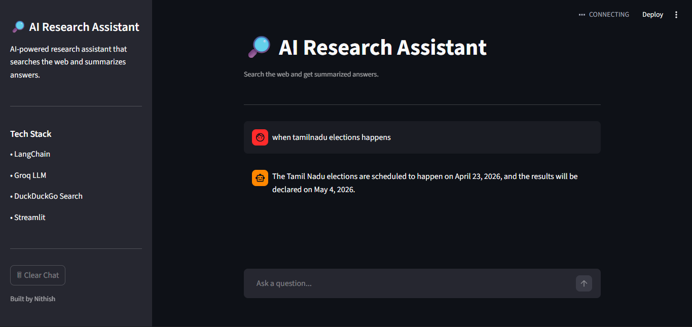

# 🔎 AI Research Assistant

An **AI-powered research assistant** that searches the web and generates summarized answers using LLM agents.

This project demonstrates how to build an **LLM agent with tool usage** using **LangChain**, **Groq LLM**, and **DuckDuckGo search**, wrapped in a clean **ChatGPT-style Streamlit interface**.

---

## 🖥 UI Preview



## ✨ Features

* 🤖 **LLM Agent** that decides when to search the web
* 🔍 **Real-time Web Search** using DuckDuckGo
* 🧠 **Prompt-engineered Research Assistant** for structured answers
* 💬 **ChatGPT-style UI** with conversation history
* ⚡ **Fast LLM inference** powered by Groq
* 🧹 **Clear Chat functionality**
* 📚 Designed for **AI research and knowledge exploration**

---

## 🏗 Architecture

User Question
↓
Streamlit Chat UI
↓
LangChain Agent
↓
Web Search Tool (DuckDuckGo)
↓
Groq LLM Reasoning
↓
Final Answer Returned to UI

---

## 🧠 How the Agent Works

The AI assistant follows a **tool-augmented reasoning workflow**:

1. User asks a question
2. The LangChain agent decides whether it needs external information
3. If needed, it triggers the **DuckDuckGo search tool**
4. Search results are passed back to the LLM
5. The LLM synthesizes a **final summarized answer**

This architecture demonstrates **LLM tool usage**, a key concept in modern **GenAI systems and AI agents**.

---

## 🖥 UI Preview

Example interaction:

User:

```
When will Tamil Nadu elections happen?
```

Assistant:

```
The Tamil Nadu Assembly elections are expected to take place in 2026, 
as the current legislative assembly term ends in May 2026.

Sources:
Election Commission of India
Wikipedia
```

---

## 🛠 Tech Stack

* **LangChain** – Agent framework
* **Groq LLM** – High-speed inference
* **DuckDuckGo Search** – Real-time information retrieval
* **Streamlit** – Interactive web interface
* **Python** – Core implementation

---

## 📂 Project Structure

```
ai-research-agent
│
├── app.py                # Streamlit chat interface
│
├── src
│   ├── agent.py          # LangChain agent setup
│   └── tools.py          # Web search tool
│
├── requirements.txt
├── .env
└── README.md
```

---

## ⚙️ Installation

Clone the repository:

```
git clone https://github.com/yourusername/ai-research-agent.git
cd ai-research-agent
```

Create a virtual environment:

```
python -m venv venv
source venv/bin/activate
```

Install dependencies:

```
pip install -r requirements.txt
```

Add your **Groq API key** in `.env`:

```
GROQ_API_KEY=your_api_key_here
```

Run the application:

```
streamlit run app.py
```

---

## 🚀 Future Improvements

Planned upgrades:

* Source citations with clickable links
* Streaming responses (ChatGPT-style typing)
* Multi-agent research workflow
* Deployment to Streamlit Cloud

---

## 💡 Why This Project Matters

Modern AI systems increasingly rely on **LLM agents with external tools**.

This project demonstrates:

* Tool-augmented reasoning
* LLM orchestration with LangChain
* Real-time information retrieval
* AI-powered research workflows

These concepts are central to **GenAI engineering and AI agent development**.

---

## 👨‍💻 Author

**Nithish**
AI / GenAI enthusiast building intelligent systems and automation tools.
